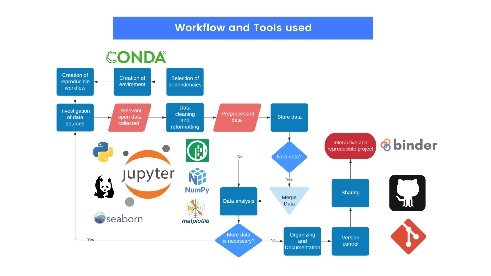

# ENLACE 2021

## Project 19: Spatial, temporal, and phylogenetic analysis of COVID-19 spread

The [ENLACE](http://resilientmaterials.ucsd.edu/ENLACE) US-Mexico summer research program summer research program at UC San Diego aims to encourage the participation of students and researchers in the sciences and engineering, while promoting cross-border friendships. The program is an opportunity to explore a variety of interests through work on varied projects, while challenging the person to always consider science in the context of societal needs.  The announcement of the program can be found [here](http://resilientmaterials.ucsd.edu/sites/resilientmaterials.ucsd.edu/files/ENLACE%20%202021/ENLACE2021_Announcement.pdf).

### Index

#### Week 1:
1. [COVID-19 cases and deaths State analyzes](notebooks/Week1States.ipynb)
2. [COVID-19 cases and deaths Municipality analyzes](notebooks/Week1Municipalities.ipynb)

#### Week 2:
1. [State codes per mexican institution](notebooks/Week2StatesCode.ipynb)
2. [Example of reading a census file and generate the correlation with case/death rate at State level](notebooks/Week2States.ipynb)

#### Week 3:
##### State
- Variables data re-collection:
1. [Ages Ranges data collection](notebooks/Week3_age_ranges_states.ipynb)
2. [Comorbidities data collection](notebooks/Week3_comorbidities.ipynb)
3. [Mobility data collection](notebooks/Week3_mobility_states.ipynb)
4. [Population density data collection](notebooks/Week3_population_density_states.ipynb)
5. [Variables download of households and population of Mexican Municipalities and States in 2020](notebooks/Week3DownloadHousingData.ipynb)
6. [Variables data collection of households and population of Mexican States in 2020](notebooks/Week3_variables_States.ipynb)
- [State analyzes](notebooks/Week3States.ipynb)

##### Municipality
-  Variables data re-collection:
1. [Comorbidities data collection](notebooks/Week3_comorbidities.ipynb)
2. [Population density data collection](notebooks/Week3_population_density_municipalities.ipynb)
3. [Variables download of households and population of Mexican Municipalities and States in 2020](notebooks/Week3DownloadHousingData.ipynb)
4. [Variables data collection of households and population of Mexican Municipalities in 2020](notebooks/Week3_variables_municipalities.ipynb)
- [Municipality analyzes](notebooks/Week3Municipalities.ipynb)

#### Week 4:
1. [Geographic State space analyzes](notebooks/Week4Municipalities.ipynb)
2. [Geographic Municipality space analyzes](notebooks/Week4States.ipynb)

#### Week 5:
- [Analyzes of variables in state level and for a single state trough the municipality level](notebooks/Week5.ipynb)

#### Week 6:
- [Clustering Variables correlated with COVID-19 in Mexico](notebooks/dev/Week7.ipynb)

#### Week 7:
- [SARS-CoV-2 Variants in Mexico](notebooks/Week7.ipynb)

### WorkFlow
The methodology to generate this project was

To run the Jupyter Notebooks in your web browser, click on the launch link below. It may take a couple of minutes to launch Jupyter Lab.

